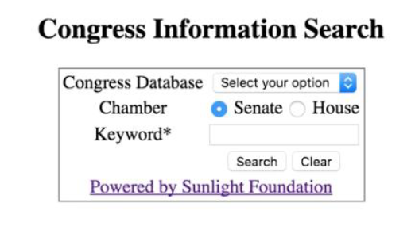
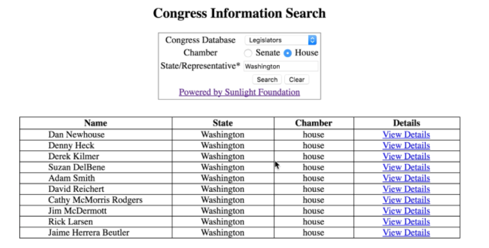

# Server-Side Scripting (Congress API)

In this Web Technologies assignment, I created a webpage that allows the user to search for congress information using the Sunlight Congress API, with the results displayed in tabular format. The purpose of the exercise was to gain experience using PHP, APIs, and using JSON parsers in PHP.

###Program Details

The PHP application consists of a form allowing the user to select a congress database (i.e., Legislators, Committees, Bills, and Amendments), choose the chamber type (i.e., Senate or House) and enter a keyword.

When the search result contains at least one record, the PHP script parses the returned JSON-formatted object and extract some fields. After extracting the data, the PHP script displays the data in a tabular format below the search form, as shown:

The Details column contains a “View Details ” link. When clicking on the “View Details” link of a certain legislator, the PHP script makes another request to the restful web service URL to query detailed information about the selected legislator, displaying it below.

**NOTE:** Sunlight Congress API no longer supported as required for this application.